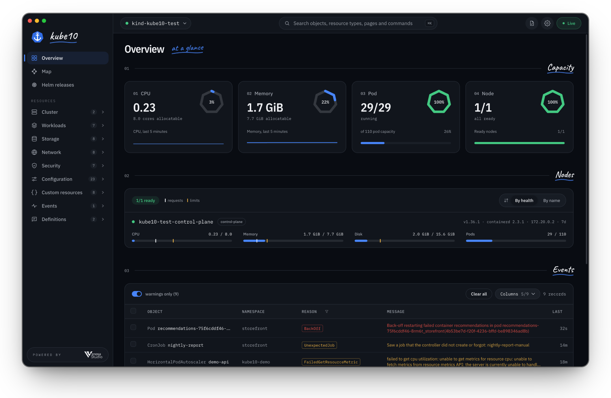
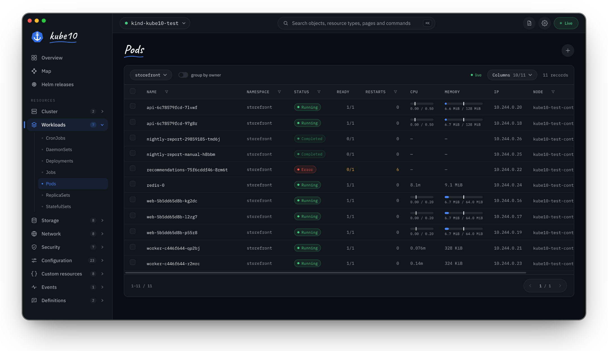
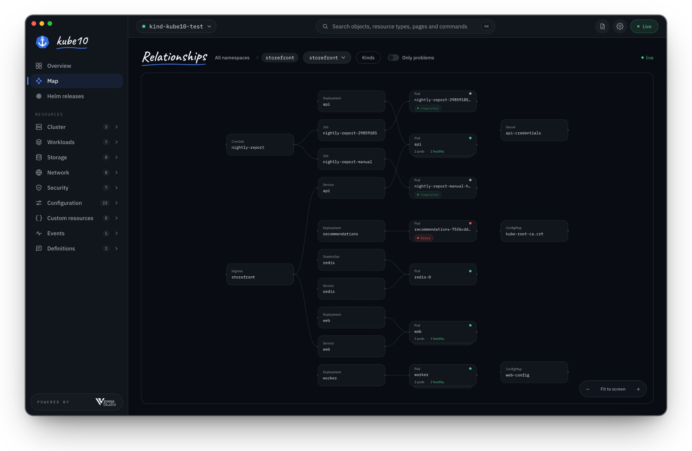
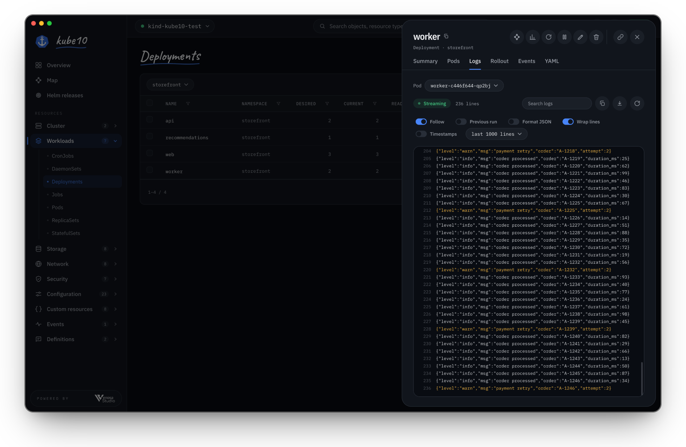
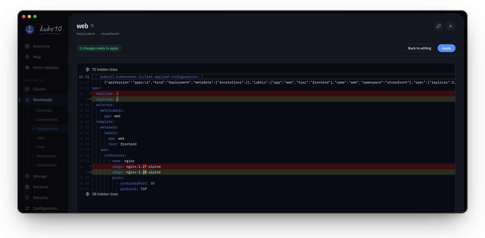

<div align="center">

<picture>
  <source media="(prefers-color-scheme: dark)" srcset=".github/assets/banner-dark.svg">
  <source media="(prefers-color-scheme: light)" srcset=".github/assets/banner-light.svg">
  
</picture>

<br>
<br>

[](https://github.com/venosa-studio/kube10-releases/releases/latest) [](#macos) 

<br>

<a href="https://github.com/venosa-studio/kube10-releases/releases/latest"></a>

</div>

kube10 is a desktop app for working with Kubernetes. Open your kubeconfig and it shows your clusters
as they are right now: workloads, nodes, events, logs and how everything connects. When you change
something, kube10 sends it to the API server as a dry run first and shows you the result before
anything is applied.

<p align="center">
  
</p>

## Download

Every file is attached to the [latest release](https://github.com/venosa-studio/kube10-releases/releases/latest).

| Platform | File | Notes |
| --- | --- | --- |
| **macOS** · Apple silicon | `kube10-<version>-arm64.dmg` | Signed and notarized by Apple. There is no Intel build yet. |
| **Windows** · x64 | `kube10.Setup.<version>.exe` | Not code-signed yet, see [Windows](#windows). |
| **Linux** · x64 | `kube10-<version>.AppImage` or `kube10_<version>_amd64.deb` | |

## A closer look

### Live lists

Every list is a Kubernetes watch, so changes show up as they happen. Filter any column, group pods
by owner and pick the columns you want.



### Relationship map

Follow an Ingress to its Services, workloads and Pods, and to the ConfigMaps and Secrets they use.
Turn on *Only problems* to see what is broken.



### Logs

Stream logs from any pod. Follow, search, format JSON, download, or read the previous run of a
container that crashed.



### Review before you apply

Edits go to the API server as a dry run first. You see exactly what will change, then decide.



## What it does

**Explore**

- Every context in your kubeconfig, each with its own connection, so one cluster going down leaves the others alone
- Live lists for every resource type, including custom resources with their own printer columns
- Overview of capacity, node health and recent warnings
- Search objects, resource types, pages and commands with <kbd>⌘ K</kbd> or <kbd>Ctrl K</kbd>
- Helm releases, read-only
- CPU and memory history charts when Prometheus runs in the cluster

**Change safely**

- Edit YAML in a full editor, or apply several documents at once with server-side apply
- Create any kind of resource with a short form or as YAML
- Scale, restart, pause and resume workloads; cordon and drain nodes; evict pods
- Delete one object or many. Volumes, and anything no controller would recreate, ask you to type a confirmation
- Actions your RBAC does not allow are turned off before you try them

**Debug**

- Exec into a container, or attach to its running process
- Port-forward to pods and services
- Open a debug shell on a node; kube10 removes it when you are done
- Follow the event stream across the cluster

**Never quietly stale**

- If the live connection drops, kube10 tells you and shows how old the data on screen is

Light, dark or system theme · English and Turkish · local time or UTC

## Installing

### macOS

Open the `.dmg` and drag kube10 into Applications. The app is signed and notarized by Apple, so it
opens without a Gatekeeper warning.

### Windows

Run `kube10.Setup.<version>.exe`. The installer is not code-signed yet, so SmartScreen may show
*Windows protected your PC*. Choose **More info**, then **Run anyway**.

### Linux

AppImage:

```sh
chmod +x kube10-<version>.AppImage
./kube10-<version>.AppImage
```

Debian and Ubuntu:

```sh
sudo apt install ./kube10_<version>_amd64.deb
```

## Updates

kube10 checks this repository when it starts and every four hours after that. New versions download
in the background and install when you quit. To install one right away, choose **Restart to update**.
**Settings → Updates** shows your version and has a **Check now** button.

> [!NOTE]
> Versions 0.5.1 and earlier cannot update themselves. Install the latest release by hand once;
> after that, updates arrive on their own.

## How kube10 connects

- It reads your kubeconfig: `~/.kube/config`, or any file you pick. You can switch files from the top bar.
- A small server inside the app listens only on `127.0.0.1` and talks straight to your clusters' API
  servers. Your kubeconfig and credentials never leave your machine.
- It uses your own credentials, so you can see and do exactly what your RBAC allows. Nothing more.
- There are no accounts and no telemetry. Apart from your clusters, the only network request is the
  update check to this repository.

---

<p align="center">
  <sub>This repository hosts kube10's installers and update feed.<br>Made by <a href="https://venosastudio.com">Venosa Studio</a>.</sub>
</p>
